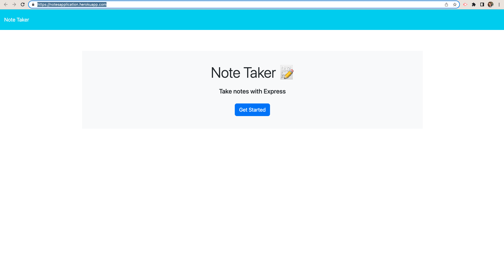

# notesApplication
This application will use an Express.js back end and will save and retrieve note data from a JSON file.
No installation is needed, just go to https://notesapplication.herokuapp.com/ to see it deployed on Heroku.

If you have any questions about the repo, open an issue or contact me directly at jaimemarsh19@gmail.com. You can find more of my work at my https://github.com/jaimemarsh